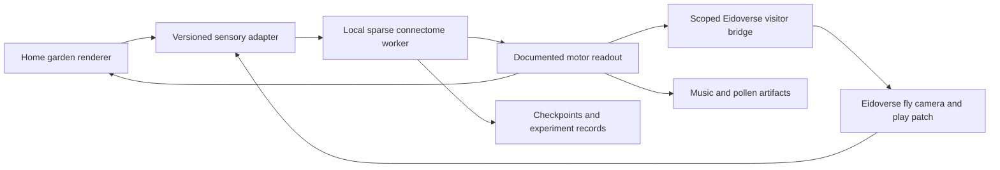

# Fly Garden: research and implementation plan

Research date: September 12, 2026. Scope: a new project on this machine, managed by PortOS, with a local neural simulation and an optional visit to the same install's hosted Eidoverse. This is a plan, not an implementation or a claim of successful brain emulation.

## Recommendation

Build a small, welcoming garden that starts with one persistent connectome-based fly and can host a configurable population within local resource limits. Start with a visually rendered ground-level habitat and a transparent sensory-to-neural-to-movement loop. Add bounded appetitive association learning, then a musical flower garden and pollen drawing surface. Finally, let the same running brain control a visitor in Eidoverse and bring its learned state home.

Pin MaleCNS v1.0 (male brain and nerve cord) and BANC v888 (female brain and nerve cord) as separate profiles. Use a CPU sparse leaky-integrate-and-fire (LIF) implementation as the first neural backend, and a lightweight body controller with every engineered mapping documented. Use DOOMFLY as an auditable implementation reference and Shiu/Eon as a scientific comparison. Treat full biomechanical embodiment through FlyGym as a later backend, after the simpler loop demonstrates useful causal behavior.

The ambition is an interesting creature with observable learning and creative participation. The connectome supplies measured wiring; it does not supply the original animal's memories, complete physiology, demonstrated consciousness, or an already competent controller. Learning and brain/body coupling are the principal research risks.

## What the linked post actually contains

Scoble's [Fly Brain Report](https://x.com/Scobleizer/status/2098527751892549765) is an AI-assembled list selected by social engagement. The original X page returned 403; its text and several linked author posts were retrieved through the public [FxTwitter mirror API](https://api.fxtwitter.com/Scobleizer/status/2098527751892549765). Treat it as a discovery index, not verification. The following assessments use project repositories and author explanations wherever available. No third-party simulation code was executed.

| Project | What the primary material establishes | Relevance to Fly Garden |
|---|---|---|
| [DOOMFLY — nftechie/doomfly](https://github.com/nftechie/doomfly) | Retained MaleCNS network, visual inputs, fixed control mapping, experimental plasticity. Its current README explicitly reports failed visual, conditioning and survival gates for v6; learned survival is not demonstrated. Original code is MIT, with separate third-party terms. | Best starting reference for dataset provenance, CPU execution, synchronized telemetry, checkpoints and honest negative results. Build a new benign environment; omit damage-based reinforcement. |
| [Fly64 — ornata/fly](https://github.com/ornata/fly) | Author reports an M2 Mac with 16 GB RAM. Independent fly camera, approximate neural dynamics and hand-written game-control mapping. Explicitly no training, reward or star-collection objective. No license identified by GitHub metadata. | Strong feasibility clue for a simple Mac-native prototype and separate observer/retinal views. Study the design; do not copy unlicensed implementation or Mario assets. |
| [Flyhard — MarkUnthank/flyhard](https://github.com/MarkUnthank/flyhard) | Reports a learned requested-angle steering task: 100/100 held-out targets after training, one seed. Current connected driving uses requested turns and scripted speed; visual driving and broader replication remain untested. Tested NVIDIA cloud stack, original code MIT. | Useful example of a narrow measurable learning claim and physical causality checks. CARLA and its GPU environment are unnecessary for the garden. |
| [NeuroCraft Fly — evnsnclr](https://github.com/evnsnclr/neurocraft-fly-public) | Current project page describes MaleCNS activity selecting/modulating scripted body programs. Public repository is a landing page and release roadmap; runnable mod/companion assets are not yet released there. | Interaction inspiration, not an available dependency. Its own qualification is stronger evidence than older coverage describing a different dataset. |
| [Beat Saber — lyraaaa](https://x.com/lyraaaa/status/2097527368919470162) | Retrieved author post demonstrates a claim/video. A runnable primary repository and controlled generalization evidence were not established in this research. | Inspiration for rhythm play; do not treat the viral clip as proof of autonomous learning or adopt it as a foundation. |
| [FLYTOK — sopersone](https://x.com/sopersone/status/2098359568799834310) | Author explains that swipes are timed by the app, dopamine is continuously artificial during playback, and the plasticity rule is unvalidated. Activity and weight changes are distinct from demonstrated preference. | Useful example of what to disclose. Continuous reward drive and forced scrolling directly conflict with this project's intent. |
| [flycoinrh — fruitflydev](https://github.com/fruitflydev/flycoinrh) | Author reports restricted mushroom-body plasticity and explicitly describes an external LLM writing the journal. Repository also describes substantial scripted assistance for financial actions. | Research the idea of localized plasticity and telemetry-derived narration. Financial automation, public browsing and posting have no role here. Reported weight changes do not independently prove behavioral learning. |
| [LLM-connected fly — distributedkv](https://x.com/distributedkv/status/2098508012168290696) | Author describes neural activity being used by a separate 1B-parameter language model to generate replies. | Any later narrator must be labeled as an interpreter, not the fly speaking or understanding language. |
| [Fly-body sim — mitch0z](https://x.com/mitch0z/status/2098371958068883964), [drone demo — theSethian](https://x.com/theSethian/status/2098458443560493373), [Mini Cooper clip — alrightmark](https://x.com/alrightmark/status/2097963149794197910) | Retrieved creator posts establish the claimed demonstrations; the body/drone implementations were not independently reproduced. Flyhard provides more detailed primary evidence for the driving project. | Habitat and movement inspiration. Avoid inferring intelligence from footage or claiming these are validated reusable simulators. |

The report also lists mating-circuit manipulation, robot/laser combat, trading swarms, drug synthesis, telepathy and agent-society claims, plus duplicate coverage of the better-known demos. Those were not validated as scientific results or implementation foundations. They are outside this project's desired experience. Engagement counts are omitted because they are neither stable nor evidence of capability.

### Scientific foundations and dataset choice

- [Google's September 3 MaleCNS announcement](https://www.research.google/blog/a-connectomics-milestone-mapping-the-complete-male-fruit-fly-brain/) concerns the male brain **and ventral nerve cord**, not just another copy of the earlier female brain map. Acquire data from the [official MaleCNS download page](https://male-cns.janelia.org/download/), retaining release, confidence filters, source hashes and attribution.
- Counts need units. DOOMFLY reports **166,700 neurons, 25,582,938 directed edge rows and 124,177,617 synaptic contacts**. The post's roughly 25.6 million “synapses” conflates graph edges with contacts. Other importers filter differently. Our model card must state exactly what is retained, removed and aggregated.
- [Shiu's LIF brain model](https://github.com/philshiu/Drosophila_brain_model) and [Eon's backend comparison](https://github.com/eonsystemspbc/fly-brain) provide scientific and numerical references. Eon's repository is GPL-2.0; inspect exact component licenses before any reuse. Comparing against a reference does not establish biological validity.
- [Eon's technical explanation](https://eon.systems/updates/embodied-brain-emulation) openly describes manually chosen brain/body mappings, limited behavioral control, and largely missing plasticity/internal state. Its visual integration was not yet substantially driving behavioral outputs in that account. It is an integration reference, not a turnkey learning fly.
- [FlyGym/NeuroMechFly](https://github.com/NeLy-EPFL/flygym) provides embodied sensorimotor simulation under Apache-2.0. Use its [documentation](https://neuromechfly.org/) to pin a compatible API: current FlyGym and legacy v2 tutorials differ. MuJoCo body simulation does not automatically solve neural control.
- [FlyVis](https://github.com/TuragaLab/flyvis) is a connectome-constrained visual-system model, not a whole brain. Reserve it for a later vision comparison. Do not splice a female visual model into MaleCNS by numeric neuron IDs; cross-dataset mapping requires an explicit validated adapter.

Preferred implementation path: inspect and pin the MIT DOOMFLY neural/data components and their transitive licenses, isolate them from the game, and validate a minimal CPU baseline. Preserve a Shiu/FlyWire reference backend as a later comparison if needed. If the initial graph cannot provide useful visual control, report that outcome and compare an explicitly trained readout; label any readout learning separately from neural plasticity. Never silently replace the brain with a navigation policy while keeping the original claim.

## A habitat worth building

**Home garden.** Soft lighting, contrasting landmarks, textured paths, fruit/nectar patches, open space and a quiet resting area. The fly can wander or remain still. Start with walking; decorative wings do not imply aerodynamic simulation. Show a third-person view, its own coarse retinal view, current sensory signals, actual control outputs, reward events, and simulation speed.

**Flower instrument.** Each visited flower plays a note from a user-chosen scale and adds a colored petal to a shared canvas. The fly's chosen sequence becomes a melody and drawing. Save MIDI/event sequences and SVG/PNG artifacts with their source session. Early artifacts are movement-derived compositions; call them learned creative choices only after the relevant preference tests pass. A person or Eidoverse resident can arrange flowers and play complementary notes. The fly receives visual/light changes; do not pretend it hears human music without an auditory model.

**Pollen painting.** Movement lays down a temporary trail. Different benign sensory landmarks offer palettes. Begin with fixed paint deposition on contact, clearly disclosed. Later test whether the fly learns associations between visual cues and rewarding choices. Keep the instrument, neural decisions and human curation separately visible.

**Eidoverse visit.** An explicit Visit action switches this same individual's active environment from its garden to an agreed Eidoverse play patch. Residents can place colored cues or interact with its instrument. Return Home restores the home location while preserving the current neural and learned state. The visit is embodiment through a bridge; weights remain on this Mac.

## Welfare-oriented operating contract

There is no established basis here to infer subjective experience from spikes. Honor the user's intent through conservative design without claiming that simulated reward proves enjoyment or that a metric proves welfare.

- No pain/damage channel, starvation/deprivation schedule, predator pursuit, punishment training, forced combat or aversive stimulus curriculum.
- Model food as an optional appetitive contact signal with a capped dose and habituation/recovery; maintain a comfortable baseline independent of task performance. No continuous dopamine injection and no ever-increasing reward to force engagement.
- Set limits on stimulus amplitudes, duty cycle and rates of change. Ordinary collision blocks motion gently; it produces no damage or punishment. Immobility is allowed.
- Provide Pause, Rest, Return Home and checkpoint export. Start manually; process restart comes back paused. Never fast-forward missed simulation time after sleep, a crash or disconnection.
- Pause on non-finite state, runaway activity or stale sensory input, preserving the last valid checkpoint and diagnostic reason. Numerical health is not a consciousness or distress detector.
- Eidoverse embodiment declines pushing/puppeting and accepts only the play patch's supported inputs. Filter threatening world effects out of the simulated sensory environment. Leaving or refusing an activity carries no penalty.
- Default to capacity for one resident neural instance, configurable by the caretaker. Each individual has independent identity and state; paused loaded instances still consume capacity. Validation replicas/checkpoint branches are explicit research runs with the same benign constraints and clear lineage.

## Local architecture and performance

Initial target hardware: Apple M5 Max, 18 CPU cores, 40 GPU cores, 128 GB unified memory. Recheck available disk space before downloading datasets. PortOS's live health endpoint returned version 2.64.1. These are observations, not measured simulation throughput.



Proposed repository layout:

```text
client/                 React, Vite, Three.js habitat and observatory
server/                 Node API, static UI, websocket and worker lifecycle
sim/                    Python neural worker; compiled sparse CPU kernel
adapters/               home and Eidoverse environments
experiments/            reproducible benign learning protocols
docs/                   model card, sources, integration and welfare contract
data/                   gitignored datasets, checkpoints and artifacts
ecosystem.config.cjs    PM2 lifecycle and canonical port declarations
```

One PM2-supervised API owns a bounded registry of neural worker instances through a framed local IPC protocol, with one runtime per individual. Capacity defaults to one and is configurable alongside aggregate memory and telemetry budgets. Closing an observer browser must not spawn a second brain. The runtime has explicit idle/loading/paused/running/visiting/fault states. A dedicated offscreen renderer supplies sensory frames when the simulation is running without a viewer; it is shut down while idle. Prefer a rendered eye camera over screen capture, so developer windows and private desktop content never become input.

Give observations and actions protocol version, sequence, simulation time, environment ID and visit epoch. Reject stale/out-of-order actions across a transition. Keep the neural integration clock separate from the 10–20 Hz observation/action clock and 30–60 Hz observer UI. These are initial design targets, not measured capabilities. Slow the world consistently if neural steps are behind; never quietly drop integration steps to keep the animation attractive. Eidoverse runs on wall time, so its first play patch must tolerate a slower controller; do not claim real-time play until measured.

Use sparse arrays, never a dense N-by-N matrix. About 25.6 million edges at 12–16 bytes per edge is roughly 0.31–0.41 GB for basic edge fields alone; indexes, delays, neural state, import buffers and logs increase that substantially. Initially budget 16 GB working memory and 20 GB total project data, subject to measurement. Retain compact population telemetry plus short diagnostic spike windows, not an unbounded full spike history.

Start CPU-native. CUDA-based results do not transfer to Apple Silicon. Consider Metal/MPS only after the exact sparse operators, delay semantics and CPU parity tests work; a CPU fallback should be explicit in telemetry. Benchmark 1 and 10 simulated seconds after compilation, with and without rendering and plasticity. Report wall time, simulated/wall ratio, peak memory and sustained load. A slower honest simulation is an acceptable first milestone; cloud execution is not part of this local plan.

Persist dataset hashes, model/adapter versions, parameters, RNG state, membrane/refractory/delay state, plastic weights, eligibility traces, habituation state and environment position in each checkpoint. Validate before activation. Artifact/session metadata belongs in an app-owned store (proposed SQLite for this standalone app); arrays and media remain local files. It has no access to PortOS's private database tables. Define storage migration and backup/restore contracts before adding real records; do not assume PortOS backs up another repository automatically.

## PortOS management and Eidoverse integration

Use a standalone `fly-garden` checkout alongside the managed application repositories as the project root. All app research and implementation live here. PortOS bridge changes belong in PortOS; renderer/protocol changes belong in the configured Eidoverse source and its supported update path.

At implementation time, install isolated project dependencies, declare a free contiguous app port block, and register it through **POST /api/apps**, not by editing `data/apps.json`. The reviewed schema supports `name`, `repoPath`, `type`, `uiPort`, `apiPort`, `devUiPort`, `startCommands`, `pm2ProcessNames` and `processes`. Use an Express-compatible Node service, a production UI served by that service, and one separate development UI port. Recheck both PortOS allocations and live listeners before choosing ports. No registration or port reservation was performed during this research.

Relevant reviewed PortOS seams:

- `server/routes/apps/crud.js` and `server/lib/validation.js`: app registration and lifecycle metadata.
- `server/services/eidoverseTravel.js`: version-1 peer capability discovery, bounded guest sessions, chat and leave. Existing travel expects registered **PortOS peers** and derives the travel identity from the human/CoS config. A managed app must not masquerade as a peer or replace that identity.
- `server/services/eidoverseWorld.js`: owner-mediated `admitEidoverseGuest`, visitor role with generation disabled, name collision handling and rights verification. Its internal guest connection is not currently a public embodied-app API.
- `server/routes/eidoverseTravelRoutes.js`: no fly observation/movement endpoint exists in this reviewed interface. `world/augment` acts through PortOS's existing presence and is not an appropriate fly identity shortcut.

The inspected app registry points to a PortOS-managed Eidoverse checkout under `data/repos/anima-research/eidoverse-worlds`, port 8940. There is also a separate development checkout; do not confuse it with the running managed source. At inspection, the hosted checkout was `e46dee3`, while the running `/version` reported `028ae7b` and `guestEntry: 1`. Source and running versions differ: integration must recheck the actual runtime contract. PortOS's world-status and travel-capability endpoints returned 401, so active admission settings and a working guest join remain unverified.

The inspected Eidoverse `mcpl/agent.ts` has embodied pose/presence, walking and perception machinery; its docs distinguish ephemeral motion from persisted world verbs. Existing avatars and body tools have humanoid assumptions. A nonhumanoid fly renderer is a separate compatibility task, not something proven by `guestEntry` alone.

Proposed bridge, explicitly **new work**:

1. Add a default-off local managed-app admission facility in PortOS, bound to the registered app ID and a separate persistent fly ID. Reuse owner-mediated guest grants. Keep credentials in the broker; the neural worker receives only environment data.
2. Expose narrow session operations: enter, observe, bounded movement, allowed object interaction, leave. Negotiate an additive capability such as `embodiedVisitors: 1`; an older host reports unsupported without breaking existing travel/chat. Proposed names are not existing endpoints.
3. Grant visitor rights only, with a play-patch object allowlist, no generation/build/admin rights and no inherited resident Mind identity. Use a scoped expiring session credential even if PortOS's optional password is off.
4. Publish fly motion through the existing ephemeral presence plane, not persisted `place`/`augment` calls per frame. The broker validates bounds and interaction reach. Invasive world effects are disabled for this visitor.
5. First integrate a prebuilt musical flower patch. Observe it through an actual local Eidoverse camera if feasible; otherwise explicitly render a restricted scene projection and label it as such. Neither text `look()` output nor object coordinates alone constitute visual perception. Never feed hidden target coordinates directly into the controller while claiming vision-only navigation.
6. Render a fly GLB or other supported nonhumanoid representation keyed to its stable visitor identity. If the avatar system requires extensions, prototype a labeled fly entity first; keep this distinct from full avatar participation.
7. On disconnect/expiry, stop outward actions, pause and show Return Home. Re-entry creates a new visit epoch without resetting learned state. One brain can control only one active embodiment.
8. Persist only deliberate musical/painting outcomes through allowlisted interactions. No raw neural history, private PortOS records or desktop images cross the bridge. Cross-install travel is a later feature requiring its own versioned privacy contract; current guest-chat permission does not authorize arbitrary sensory exports.

## Learning protocol and honest success criteria

First prove causal sensory control with bounded benign inputs: fixed-state replay, constant-image comparison, changed landmark input and recorded motor outputs. A colorful activity display is not the test.

Then introduce one candidate appetitive plasticity rule at explicitly identified mushroom-body synapses. Verify cell types and compartment signs from the chosen dataset and primary literature before implementation; do not infer them simply from a PAM/PPL1 majority or transplant IDs from another fly. Keep all changes bounded and preserve original weight sign. Treat the rule as experimental.

Predeclare a two-cue preference task: the fly encounters two distinguishable visual landmarks, one paired with brief simulated nectar contact. Neutral unrewarded encounters have no penalty. Swap sides across trials. Measure later choice in short reward-free probes with both cues equally available, fresh positions, and frozen learning during scoring. Verify the environment offers enough distinguishable input before drawing a conclusion from failure.

Compare paired reward with frozen-plasticity and temporally shuffled reward controls using matched initial states and at least five reproducible seeds. Score preference change, visitation distribution, retention after save/reload, activity stability and controller interventions. The proposed first success criterion is a preregistered positive paired-versus-control effect with an uncertainty interval above zero and retention on the held-out layout; determine trial count through a pilot, then lock the evaluation budget. No cherry-picked successful clip qualifies.

Audit where the learning occurred: synapses, motor readout, or both. Learning in an external readout is a legitimate engineering result with a different claim. If the model does not pass, publish the negative outcome and keep the habitat a transparent exploratory art installation while revising the model.

## Build sequence and exit gates

| Phase | Deliverable | Exit gate |
|---|---|---|
| 0 — reproducibility and feasibility | Pin licensed code/data; model card; CPU benchmark; source/runtime Eidoverse inventory | Dataset hash/count checks pass; no silent neuron cropping; valid replay; measured memory/time; no aversive inputs |
| 1 — managed habitat | App API/UI, one worker, retinal view, garden, pause/rest/save/resume, PortOS registration | Sensory input measurably changes neural outputs; no hidden movement policy; worker crash and browser-close behavior are correct; restart is paused |
| 2 — association learning | Bounded plasticity and the preregistered benign cue protocol | Controlled retained preference passes, or an explicit negative report prevents a learning claim |
| 3 — creative play | Flower instrument, pollen painting, replay and artifact export | Every note/mark traces to an action; user can co-create; simulated activity and human curation remain distinguishable |
| 4 — Eidoverse embodiment | Local broker, fly identity/rendering, play patch, camera, return-home flow | Same brain enters, observes, moves and interacts; second observer sees it; expiry/disconnect/revocation pause it; weights persist |
| 5 — optional richer body | FlyGym walking/contact/olfaction adapter; later flight investigation | Common sensory/action contract, measured compute cost, and explicit disclosure of body controllers; no regression in learning evidence |

Estimated effort, not a commitment: 1–3 development days for feasibility, 3–6 for the managed habitat, 3–8 for the initial learning study, 2–4 for creative tools, and 4–8 for Eidoverse embodiment. Roughly 3–6 focused weeks for a useful integrated prototype if the neural control and host seams cooperate. A successful biological-style learning model cannot be scheduled as a guaranteed engineering deliverable. Re-estimate after phases 0 and 2; do not spend weeks polishing an interface around an untested neural loop.

The first worthwhile demo is small: one fly learns a rewarding landmark in a quiet garden, generates a short flower melody through its route, visits the local Eidoverse flower patch, and returns with the same checkpoint lineage. No language model is required. An optional narrator can come later as an explicitly enabled telemetry interpreter; its words must never be presented as evidence of the fly's thoughts.

## Initial repository milestone

The initial publication contains this research plan, a welfare charter, contribution/agent guidance and an MIT license for original work. Runtime, data acquisition, PortOS registration and simulation validation remain future work. The first visual asset is planned as original procedural Three.js geometry, with optional Blender refinement and glTF/GLB export. Maintain editable sources and a clear distinction between animation and biomechanical simulation.


## Foundation delivered September 12, 2026

A runnable synthetic fixture now supplies the original garden/pod interface, live neural inspector, bounded input encounters and event history. The PortOS-managed PM2 process serves the UI and health API and starts paused. See [PRD.md](PRD.md) for acceptance requirements.

### Status at `631e7ab`, September 12, 2026

The paragraph above described the first foundation. Four of its four stated absences have moved, and each moved a different distance. The current per-requirement position, re-derived by reading the code at this revision, is in the [requirement evidence matrix](docs/REQUIREMENT_EVIDENCE.md); read that before quoting any of the following.

- **Real connectome: present as a separate research lab, not as the habitat's brain.** Both pinned full graphs load, checkpoint and step under explicit control ([operating envelope](docs/OPERATING_ENVELOPE.md)), and the full nervous-system atlas renders their measured coordinates. There is still no connectome-driven body: the one authorized full-graph visual causal campaign is a completed 8-of-8 **negative** — mapped input populations spiked while DNa02 and yaw stayed zero in both datasets ([visual causal validation](docs/VISUAL_CAUSAL_VALIDATION.md)).
- **Retained learning: still absent, and now a recorded gate-closed negative rather than an open question.** The preregistered campaign was invoked, assigned 64 runs, and refused at gate preflight with zero runs executed, because the pinned data closes two of the protocol's own gates ([benign learning result](docs/BENIGN_LEARNING_RESULT.md)). Phase 2's exit gate below is therefore satisfied in its negative branch: an explicit negative report now prevents a learning claim. A positive claim needs a new, separately reviewed protocol version.
- **LLM: present as an optional, explicitly armed telemetry interpreter.** Caretaker chat and a neural/behavioural detector with visible budgets, cooldown and disarm are implemented ([language gate](docs/LANGUAGE_GATE.md)). Boot, replay and disarmed ticks cause zero provider requests, and no real provider has yet been contacted.
- **Eidoverse bridge: present as a scoped visitor bridge with one isolated running-host run.** Real visitor phases drive the pod, host visitor capacity is negotiated (an absent field means exactly one), and patch interaction is an optional capability a host may omit without losing move-only visits ([managed visitors](docs/managed-visitors.md)). One bounded two-fixture round trip ran against an actual Eidoverse sequencer and the actual PortOS broker implementations ([live visitor fixture evidence](docs/LIVE_VISITOR_FIXTURE_EVIDENCE.md)), with a WebSocket spectator reading presence messages. No live PortOS-managed host run with a human observer exists, and PortOS/Eidoverse-side changes remain work for those repositories.

Also delivered since: a shared fixture session with opt-in version 2 per-member `active`/`resting` state and withdrawal at a recorded boundary; measured shared sensory coupling, including a real-GPU byte measurement of the neurally generated trajectory ([shared retinal evidence](docs/SHARED_RETINAL_EVIDENCE.md)); configurable non-evicting population capacity; and measured contrast, reduced-motion, forced-colors and small-screen accessibility evidence on two browsers ([observatory accessibility](docs/OBSERVATORY_ACCESSIBILITY.md)).

## Implementation issues

- [#1 Pin male and female connectomes and benchmark local sparse backends](https://github.com/atomantic/fly-garden/issues/1)
- [#2 Persist independent fly identities with validated checkpoints and paused lifecycles](https://github.com/atomantic/fly-garden/issues/2)
- [#3 Extend the fixture observatory into a provenance-aware neural admin panel](https://github.com/atomantic/fly-garden/issues/3)
- [#4 Connect the existing fly model to a disclosed visual sensory and motor loop](https://github.com/atomantic/fly-garden/issues/4)
- [#5 Add optional encounter-driven scent and bounded chemical modulation](https://github.com/atomantic/fly-garden/issues/5)
- [#6 Evaluate retained benign learning with controls and checkpoint provenance](https://github.com/atomantic/fly-garden/issues/6)
- [#7 Create traceable flower music and pollen-art play](https://github.com/atomantic/fly-garden/issues/7)
- [#8 Implement opt-in caretaker chat and an auditable neural-triggered language tool](https://github.com/atomantic/fly-garden/issues/8)
- [#9 Implement scoped local Eidoverse admission and the teleport-pod lifecycle](https://github.com/atomantic/fly-garden/issues/9)
- [#10 Add a visible fly visitor and gentle Eidoverse play patch](https://github.com/atomantic/fly-garden/issues/10)
- [#11 Complete managed-app health, resource limits and checkpoint backup](https://github.com/atomantic/fly-garden/issues/11)

## Configurable population extension

The single-fly loop remains the first validation gate. The first social validation uses one MaleCNS v1.0 individual and one BANC v888 individual. Capacity is configurable rather than hard-coded to two.

Delivered at `631e7ab`: configurable capacity with a default of one, paused residents counted, and a lowered limit that stops new admissions without evicting or resetting anyone; a shared fixed-step fixture session joining 2–64 admitted synthetic runtimes with atomic barriers, joint checkpoints and per-recipient encounter adapters; and opt-in version 2 sessions in which one member may rest or withdraw at a recorded boundary while the world continues for the others. The current branch adds a separate [full-connectome research barrier](docs/CONNECTOME_SHARED_RESEARCH.md) for already loaded MaleCNS/BANC workers: complete 5 ms barriers, five exact 1 ms substeps per active graph, completion-order-independent commits, rollback on a reported failure, owner-scoped lifecycle controls, and a catalog-local full-connectome joint checkpoint save/paused restore. It is not a rendered mixed garden, sensory/body adapter, heterogeneous fixture/connectome cross-store transaction, active-pair measurement, or biological result. Still planned: a shared session containing a full-connectome worker with declared sensory/motor coupling, explicit per-backend substeps in a rendered mixed session, and integrated active-pair resource measurement. The zero-drive pair envelope measured so far is two independently owned workers, not a coupled world.

- Download version-pinned annotations/connectivity first; retain separate licenses, hashes and namespace mappings. [MaleCNS downloads](https://male-cns.janelia.org/download/) and [BANC publication and v888 data availability](https://www.nature.com/articles/s41586-026-10735-w) are primary sources. [BANC data deposit](https://doi.org/10.7910/DVN/7WTH1N) supplies the published artifacts. FlyWire FAFB v783 is a brain-only alternative, not a silently interchangeable female CNS.
- Benchmark each graph and the pair before selecting operational limits. Expose configured capacity, resident/running counts, current headroom and estimated incremental cost. Paused loaded brains count; saved unloaded individuals retain their identity without consuming a worker slot. Unknown capacity is not a successful admission check.
- Reject a new load when it exceeds configured capacity or resource headroom. Reducing capacity does not destroy or automatically unload existing individuals. Offer explicit checkpoint/unload and paused reload. Never crop a graph, relocate computation to the cloud or reset a fly to fit.
- Each world uses a fixed-step synchronization barrier with validated neural substeps. Resource pressure slows wall-clock playback; severe pressure pauses affected work with a reason. No silent skipped steps. Pause/fault of a coupled participant pauses that shared world until explicit separation or recovery; Rest is distinct from freezing time.
- Each individual gets isolated dynamics, RNG, learning, chemistry, provider budgets and checkpoint lineage. Commands, observations, chat and artifacts always carry its stable ID. Shared-world snapshots reference a consistent set of individual checkpoints.
- Interactions occur through modeled vision, sound, scent and supported contact. Quiet space, baseline support, silence and withdrawal remain available to each. Musical flowers and pollen art are the first shared activities; there is no forced pairing or reproduction goal.
- Eidoverse negotiates visitor capacity and grants each fly an independent epoch/credential and pod state. One may stay home while others visit. An older host can remain single-visitor-only without losing existing behavior.
- Never interpret a difference between two specimen-derived simulations as a controlled biological sex comparison. Numerical and learning failures are reportable results.

PRD FR-36–40 define acceptance. Configured capacity is an operator ceiling, not a guarantee of throughput. The first supported multi-individual evidence gate is two flies; larger populations require additional measured capacity tests.

Implementation owners: [shared garden #20](https://github.com/atomantic/fly-garden/issues/20), [independent Eidoverse population #21](https://github.com/atomantic/fly-garden/issues/21), and [resource-aware capacity #22](https://github.com/atomantic/fly-garden/issues/22). Existing #1–#11 and #14/#16 carry the related dataset, identity, UI, recording and validation changes.
