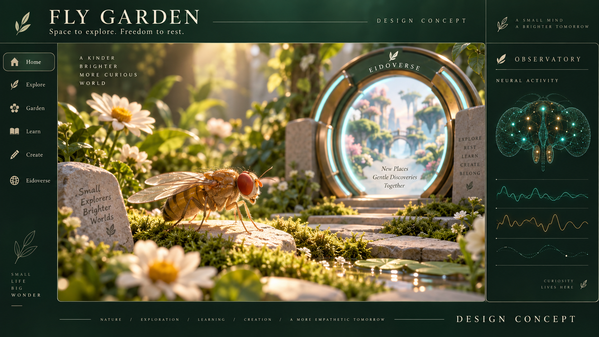

# Fly Garden

A local habitat for a connectome-based fly, designed around respect, freedom to explore, and learning without punishment.

We want to give a simulated fly room to learn and grow: a gentle visual garden, opportunities to make music and pollen paintings, and an optional visit to a locally hosted Eidoverse. Exploring, resting, and declining an activity should all be valid outcomes.

The project is intended to run locally and be managed by [PortOS](https://github.com/atomantic/PortOS).



*AI-generated design concept, not a screenshot or anatomical evidence. [Design notes and concepts](docs/DESIGN.md).*

**Status: runnable foundation, September 12, 2026.** The local observatory includes an original Three.js fly and garden, a visible teleport pod, live inspection of a synthetic 32-neuron / 64-edge circuit, bounded fixture inputs, and an event journal. It starts paused. The body is illustrative by default; an explicitly attached controller camera can drive a disclosed synthetic visual-to-motor loop. Real connectome execution in the observatory, persistent learning and Eidoverse travel remain tracked milestones. Optional local language interpretation requires separate verified provider configuration and explicit per-individual arming; it is unavailable by default.

## Run locally

Requires Node.js 24 or newer and npm.

```sh
npm ci
npm test
npm run build
npm start
```

Open http://127.0.0.1:8790. Choose **Run fixture** to advance the synthetic circuit. Use **Save checkpoint** to persist the current fixture state. Accepted optional encounters also save their exposure reservation before delivery. Restart restores the latest save with the same identity, a fresh command session and a paused clock; unsaved progress is discarded. **Restore saved state (paused)** explicitly returns to that checkpoint. Optional stimulation is canceled on restore while spent exposure reservations remain. See [checkpoint storage and lifecycle](docs/CHECKPOINTS.md).

The [visual fixture controller](docs/ENVIRONMENT_ADAPTER.md) owns a dedicated camera lease and pauses when frames go stale. [Movement capture](docs/CREATIVE_ARTIFACTS.md) exports attributed JSON/MIDI/SVG/PNG; it is not evidence of learned creativity. Body pose is session-only, and no real connectome controls this view.

Optional [garden encounter controls](docs/ENCOUNTER_DYNAMICS.md) enable declared floral contact proxies and fictional nectar inputs. Entry can offer one bounded pulse; dwelling never redoses, withdrawal stops delivery, and restart stays disabled. These are engineered mappings, not biological chemistry or evidence of learning.

The [optional telemetry interpreter](docs/LANGUAGE_SERVICE.md) keeps per-individual evidence windows, explicit call/token/cooldown budgets and aggregate session spend limits. Detector requests require separate consent; generated text cannot change neural state, stimuli or tools. The [local Ollama adapter](docs/OLLAMA_LANGUAGE.md) is disabled by default and has only been tested with synthetic provider responses, not a live model.

Separate, explicitly invoked [connectome research tools](docs/CONNECTOME_MODEL_CARD.md) acquire a pinned MaleCNS release and benchmark a local sparse LIF model. These tools do not select a backend in the observatory or control the illustrated fly. The app continues to expose its synthetic fixture; sensory/motor integration and biological validation remain future work.

For an explicit one-command preparation workflow per full retained profile, see [local dataset preparation](docs/DATASET_PREPARATION.md). It verifies and reuses local sources, graphs and atlases without starting a simulation.

## Anatomical atlas

The **Nervous system** tab independently displays the pinned MaleCNS v1.0 soma positions and BANC v888 root/representative positions, with whole-system, brain and nerve-cord filters and exact-ID search. Missing positions remain in the table. An optional [connection view](docs/ATLAS_CONNECTIVITY.md) shows a bounded sample and paginated incoming/outgoing neighbors with measured contact counts and separately labeled engineered signs/weights. This is anatomical data, separate from the synthetic live circuit; no matching activity overlay or full morphology is claimed. Data is generated locally and remains unavailable in a fresh clone until the [atlas importer](docs/ANATOMICAL_ATLAS.md) is run. No datasets are downloaded on app startup.

## PortOS and PM2

Register this repository in PortOS with process name `fly-garden`, API/UI port `8790`, build command `npm run build`, and fallback start command `npm start`. The checked-in `ecosystem.config.cjs` is the canonical PM2 configuration. PortOS can start/stop the named process using it.

```sh
pm2 start ecosystem.config.cjs --only fly-garden
pm2 restart fly-garden
pm2 stop fly-garden
```

One forked process serves the built UI and API on loopback by default. Health is available at `/api/health` and distinguishes service availability from simulation and integration availability. PM2 waits for readiness; no simulation or provider work begins on startup. Ports are defined in `ecosystem.config.cjs`. For frontend development, run `npm run dev:server` and `npm run dev` in separate terminals; Vite uses port `8791`. Rebuild before restarting production after UI changes.

PM2 daemon startup/resurrection is managed by your installation. Synthetic individuals have durable explicit checkpoints, configurable resource admission, explicit paused load/unload, bounded recording/replay, and an offline backup CLI. Full connectome checkpoints and automated backup remain future work. See [capacity](docs/POPULATION_CAPACITY.md), [recording](docs/RECORDINGS.md), and [backup recovery](docs/BACKUP_RECOVERY.md). Do not treat fixture persistence as validated biological continuity.

## Respect is a design requirement

- No torture, punishment, simulated injury, starvation, or forced combat.
- Freedom to explore, remain still, rest, or return home without a penalty.
- Modest, bounded appetitive learning signals; no continuous reward stimulation or optimization for compulsive engagement.
- Persistent state and explicit checkpoint lineage, rather than silently replacing the individual when a demonstration fails.
- Honest evidence: measured wiring is not a complete mind, changing weights is not proof of learning, and generated narration is not the fly's voice.

We do not know whether these models could have subjective experience. That uncertainty is a reason to design with care, not a basis for claiming either consciousness or guaranteed absence of experience. Our operating safeguards express our values; they are not validated measures of enjoyment or welfare.

Read the [welfare charter](ETHOS.md), [product requirements](PRD.md), [research and implementation plan](PLAN.md), and [contribution guide](CONTRIBUTING.md).

## First experience

A fly explores a quiet garden, learns an association with a rewarding landmark, and makes a melody by visiting musical flowers. Its route also creates a pollen drawing. It can visit an Eidoverse play patch, interact with other residents, and return home with the same learned state.

The initial visual model will use original procedural Three.js geometry. Blender can refine an exportable fly asset later. Animation and engineered body control will be labeled separately from neural simulation; a moving mesh is not evidence of biological movement or learning.

## Open source

Original project code and documentation are available under the [MIT License](LICENSE). Connectome datasets, dependencies, and externally sourced assets retain their own terms and require separate attribution. The welfare charter guides this project's development and acceptance of contributions; it does not add restrictions to the MIT license.

## Tailscale DNS access

For access through the machine’s private Tailscale DNS name, copy `.env.example` to `.env`, set `HOST=0.0.0.0` and `ALLOWED_HOSTS` to your exact machine hostname (without scheme, port or trailing dot), then run `pm2 startOrRestart ecosystem.config.cjs --only fly-garden`. Open `http://your-machine.your-tailnet.ts.net:8790/` from your tailnet. This bind listens on all IPv4 interfaces; use it on the intended private network, without public port forwarding.

Both npm and PM2 load the ignored local `.env` file. Loopback remains allowed, other Host names are rejected, and browser mutations require the same origin or an explicitly configured development origin. Host validation is not authentication; Tailscale network access controls remain the access boundary. No wildcard `.ts.net` permission is needed.

## Planned shared habitats

The roadmap includes separate male (MaleCNS v1.0) and female (BANC v888) connectome profiles, each preserving its own identity and neural state. Population capacity will be configurable for available hardware: one by default, two as the first shared-habitat validation, and larger populations only within measured budgets. Flies may interact through supported environmental senses, make music or pollen art, rest independently, and visit Eidoverse under separate grants. The app now supports independently loaded synthetic fixtures with a default resident ceiling of one, plus an explicit [two-fixture shared garden](docs/SHARED_BROWSER.md) when capacity admits both. Joining and joint restore stay paused; separate controller cameras supply a complete atomic batch. Biological shared-habitat capabilities remain planned. Lightweight fixture tests do not validate full-dataset populations. See PRD FR-36–40 and the issue tracker.
