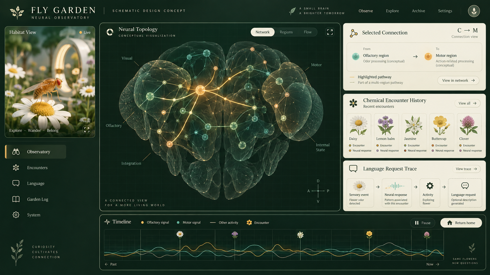

# Observatory design

A quiet botanical habitat uses pine, sage and warm amber. The fly can eventually explore, rest or enter an open teleport pod. The UI must show real admission and return acknowledgments; animation alone never establishes Eidoverse presence.

## Concept images

Both images were generated with OpenAI imagegen on September 12, 2026 for this project. They are aspirational visual studies, not application screenshots, scientific diagrams or measured neural activity. Flowers, region labels, connections and traces are illustrative. No reference screenshot assets were copied into the repository. Original runtime fly geometry lives in `client/src/Scene.jsx`.

## Implementation direction

- Keep habitat, neural inspector, encounters, language and travel easy to navigate independently.
- Display source, units, model limitations and stale/disconnected state beside telemetry.
- Distinguish measured anatomy, simulated activity, learned parameters, engineered adapters and generated language.
- Tie encounter and language traces to timestamped events and checkpoint lineage.
- Keep return-home and rest available without reward penalties. Never make pod travel a confinement task.

## Chemical interaction reference

[SameSmell](https://anzal1.github.io/samesmell/) inspired encounter visualization. Its [source README](https://github.com/anzal1/samesmell/blob/main/README.md), simulation and data-loading code describe simplified dynamics over selected connectome structures. Such demonstrations do not validate pharmacology, subjective experience or creative effects. No repository license was identified during research; its code and assets are study references only and are not reused here. Our initial encounter buttons apply disclosed bounded synthetic inputs; modeled receptors and voluntary environmental encounters require separate implementation and evaluation.
